# R1:	Identification of the problem you are trying to solve by building this particular app.

The Martial Arts API I have designed, serves an important purpose for those martial arts enthusiasts or fighter-trained practitioners in my local area. Martial arts is a popular hobby and sport steeped in rich history and there are many different styles.

These styles can be broadly categorised into several groups based on their country of origin, such as Chinese martial arts (Kung Fu, Wushu), Japanese martial arts (Karate, Judo, Aikido, Juijitsu), Korean martial arts (Taekwondo, Hapkido) and Southeast Asian martial arts (Silat, Muay Thai, Muay Boran). Most other styles share similarities with these main styles.

Martial arts is not only a great way to stay physically fit, but it also teaches important values such as discipline, respect and perserverance. It is a way of life for some and it has significant impact on their overall health and well-being.

However finding a suitable martial arts gym or school can be quite a challenging task, especially for beginners. Many people are just not familiar with the different styles of martial arts or the quality of instruction offered at various gyms.

 The idea behind my Martial Arts API was to provide a comprehensive list of martial art gyms in my local area, along with important details such as contact information, style of martial art, description of gym, location and gym name. This will help users find a gym that suits their needs and preferences.


# R2:	Why is it a problem that needs solving?

The Martial arts API was built as a solution to a problem many martial arts practitioners face: finding a suitable gym or school to train at. This can be a challenging task, especially for beginners or people that may be new to a particular area. There are several reasons why this is a problem that needs solving:

Firstly, martial arts is a physical activity that requires proper instruction and guidance to learn and practice safely. Without proper instuction, students run the risk of injuring themselves or others, or develop bad technique that could hinder their progress. Finding a suitable gym or school with qualified instructors and a good reputation is essential for anyone looking to learn martial arts.

Secondly, martial arts is a diverse field with so many different styles and philosophies. Each style has its own unique techniques and training methodology, and not all styles may be suitable for everyone. Finding a gym or school that offers the style of martial arts that you are interested in can be challenging, especially in areas where there may be limited options.

Thirdly, martial arts is also a community-based activity as much as it is a self-dicliplined one. It requires interaction and feedback from other practitioners. Practicing martial arts with others can help improve skills, build confidence and foster a sense of comaraderie and respect. Finding a gym or school with a supportive and welcoming community can be benificial for anyone looking to practice or learn martial arts.

I believe my Martial Arts API solves these problems by providing comprehensive information about the different gyms and styles of martial arts in my local area of Caboolture, in sunny Queensland. It allows users to find a gyms or schools to train in with qualified instructors, martial arts styles they may be interested in and contact information for the gym (name, address, phone number etc). It also provides a platform for users to leave a comment about their experiences, which can help others make an informed decesion about where to train.


#  R3:	Why have you chosen this database system. What are the drawbacks compared to others?


For my Martial Arts API I have chosen to use PostgreSQL as the database system.

PostgreSQL is a powerful object-relational database management system (DBMS) that has many benefits over other DBMSs. One of the main benefits of postgreSQL is its scalability. It can handle large amounts of data and complex queries efficiently, making it a good choice for applications that require high performance and reliability. PostgreSQL also provides support for advanced features such as transactions support for JSON and other data types.

Another benefit of PostgreSQL is its data integrity. It provides strict data validation and integrity checks to ensure that the data is accurate and consistent. This is important for applications that require high levels of data accuracy, such as healthcare systems for instance, or financial applications.

PostgreSQL also has a large and active community of developers and users who contribute and provide help and support to users. This community has extensive documentation, tutorials and forums to learn and get help.

PostgreSQL also meets ACID compliance. ACID stands for Atomicity, Consistency, Isolation and Durability. These are important properties that ensure that database transactions are processed reliably and consistently. This means that applications built on PostgreSQL (like this one) can rely on its ability to process transactions reliably and consistently, even under high load and concurrent user access.

For this API assignment, PostgreSQL doesn't have much in drawbacks aside from initial setup can be tricky and its a little more difficult to learn. One of the drawbacks however is its compatability with other technologies. While it is compatible with many computing languages and frameworks, it may not be the best choice for applications that require integration with specific technologies that do not have built-in support for PostgreSQL.

With a lot of positives and not a lot of drawbacks, that is what makes PostgreSQL such a flexible and versatile database system that can be used for a wide range of applications. It is why I chose it for my API project.

### RESOURCES:

https://www.upguard.com/blog/postgresql-vs-mysql

https://www.postgresql.org/about/


https://www.cybertec-postgresql.com/en/postgresql-overview/advantages-of-postgresql/#:~:text=Advantages%20of%20PostgreSQL%201%20BENEFITS%20OF%20POSTGRESQL%20PostgreSQL,MIGRATING%20TO%20POSTGRESQL%20...%204%20PROFESSIONAL%20HELP%20


https://www.prisma.io/dataguide/postgresql/benefits-of-postgresql


# R4:	Identify and discuss the key functionalities and benefits of an ORM


Object-Relational Mapping(ORM) is a programming technique that enables developers to map object-oriented programming (OOP) concepts to relational database concepts. It acts as a software layer between the application and the database, providing a high-level, object-oriented interface for working with data in relational databases.

ORMs offer several functionalities and benefits, including simplified database access, improved productivity, portabability, object-oriented approach, data integrity and scalability. 

- Simplified Database Access: ORMs provide a simplified way of accessing the database without having to write complex SQL queries. Developers can work with database objects as if they were native objects in their programming language, which makes it easier to work with and reduces the amount of code required to access data. ORMs provide an abstraction layer between the application and the database, which in turn makes it easier to manage data and reduces the need for developers to write low-level SQL queries.

- Improved Productivity: ORMs can improve developer productivity by reducing the amount of time required to write and maintain code. They eliminate the need for developers to write the low-level SQL queries (that we spoke about earlier) which can be time consuming and prone to errors (syntax, my old foe). This allows developers to focus on writing application logic rather than dealing with database details. ORMs also provide features such as automatic schema generation, which can further reduce the amount of time required to set up the database.

- Portability: ORMs provides portability across different database systems. This means that developers can write code that works with different database systems without having to modify the code. This makes it easier to switch between different database systems or to support multiple database systems simultaneously. ORMs also provide features such as database abstraction layers, which further simplifies the process of working with different databases.

- Object-Oriented Approach: ORMs provide an object-oriented approach to working with data, which is more second nature for developers who are familiar with OOP concepts. They allow developers to work with data in a way that is more natural and intuitive, making it easier to write and maintain code. ORMs also provide features such as inheritance and polymorphism, which can further simplify data management.

- Data Integrity: ORms provide built-in support for data integrity which helps ensure that data is consistent and accurate. They automatically validate data before it is saved to the database, which helps prevent data corruption and ensures that the data is consistant across the application. ORMs also comply with ACID principles of Atomic, Consistent, Isolated and Durable. ACID is a set of guiding principles that ensure database transactions are processed reliably, which helps with data integrity.

- Scalability: ORMs provide scalability by allowing developers to work with large datasets efficiently. They can optimise queries and manage connections to the database, which can improve performance and reduce resource usage.

### RESOURCES:

https://www.baeldung.com/cs/object-relational-mapping

https://www.freecodecamp.org/news/what-is-an-orm-the-meaning-of-object-relational-mapping-database-tools/

https://benefitof.net/benefits-of-object-relational-mapping/

https://midnite.uk/blog/the-pros-and-cons-of-object-relational-mapping-orm


# R5:	Document all endpoints for your API

Endpoints for my API project are set out in the following format:

## Route:"/"
- Method:
- Functionality:
- Local Host URL:
- JSON Body & example:

Local host URL will be localhost:8080/ using Postman (third party service, more on this later)

All actions will require that the user is logged in. Actions that need Admin authentication or permission will have a special field added 'Admin Required'.

# Auth:

# URL prefix = "/auth"

## Route: "/register"

- Method: POST
- @auth_bp.route('/register', methods=['POST'])
- Functionality: Well this creates a new user. We already have "is_admin" set as "false" as default, unless specified.
- Local Host URL: Localhost:8080/auth/register
- JSON Body & example:

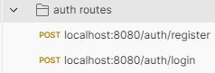
- Auth routes folder set up in Postman

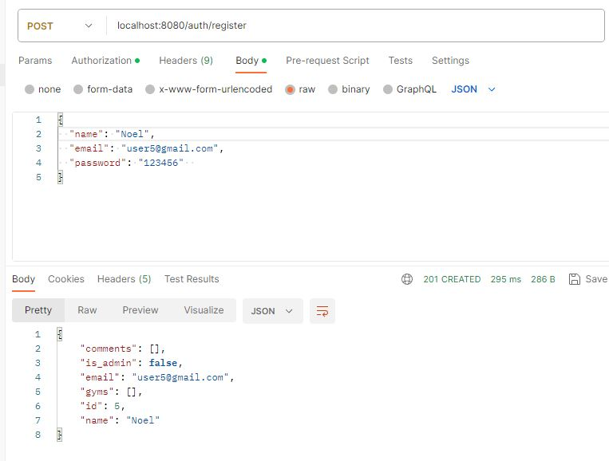
- Shows user created


## Route: "/login"

- Method: POST
- @auth_bp.route('/login', methods=['POST'])
- Functionality: Checks User with email and password, if match they create an access token.
- Local Host URL: localhost:8080/auth/login
- JSON Body & example:

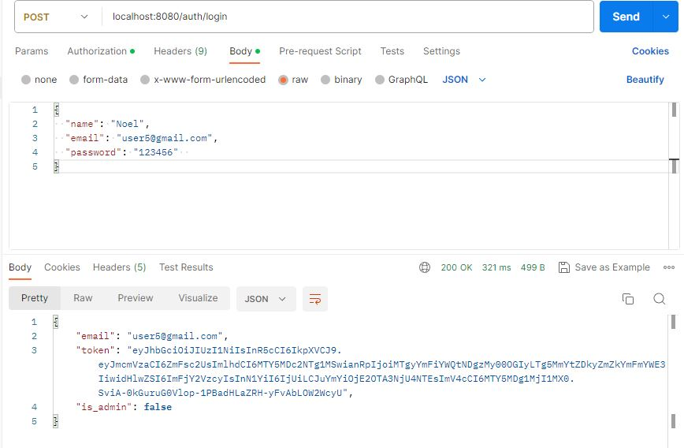
- Access token was created! Yay!


## Route: "/user/<int:user_id>"

- Method: DELETE
- @auth_bp.route('/user/<int:user_id>', methods=['DELETE'])
- Functionality: Checks User with ID, if user_id is in the system, then it gets deleted
- Local Host URL: localhost:8080/auth/user/<int:id>
- JSON Body & example:

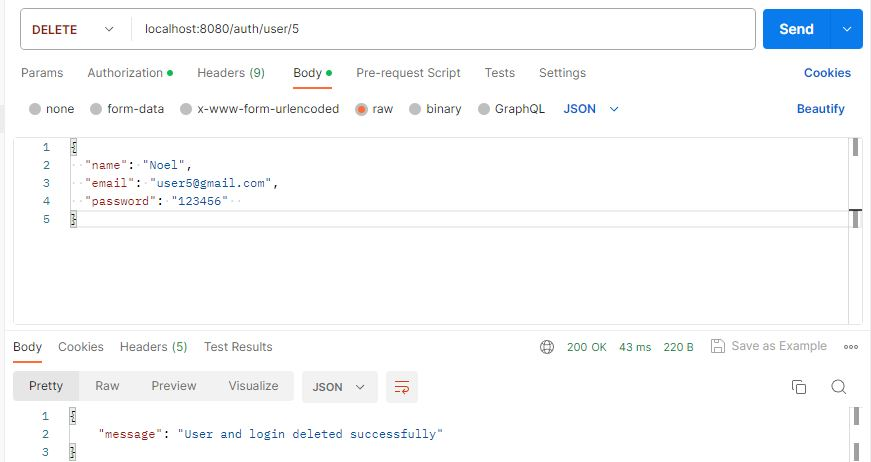
- User ID was found and successfully deleted


# Gyms:

# URL prefix = "/gyms"

## Route: "/"

- Method: GET
- @gyms_bp.route('/', methods={"GET"})
- Functionality: Returns a list of all gyms
- Local Host URL: localhost:8080/gyms
- JSON Body & example:

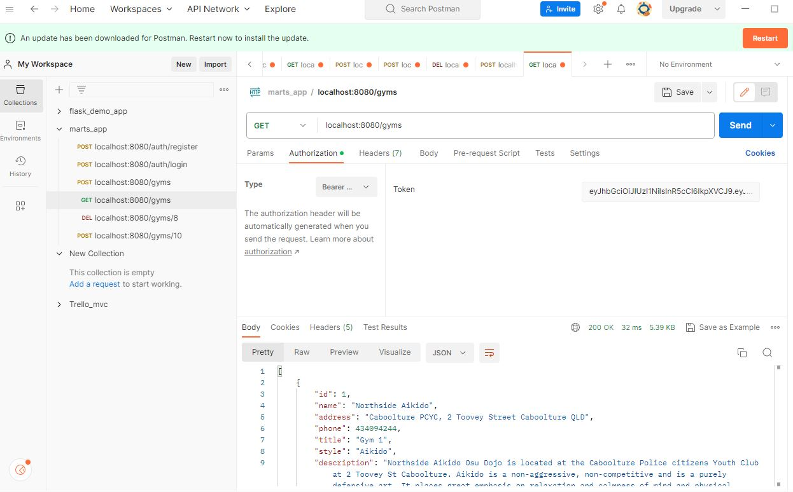
- Lists all gyms available (So far nine...)


## Route: "/"

- Method: POST
- @gyms_bp.route('/', methods=['POST'])
- Functionality: Creates a new Gym
- Local Host URL: localhost:8080/gyms
- JSON Body & example:

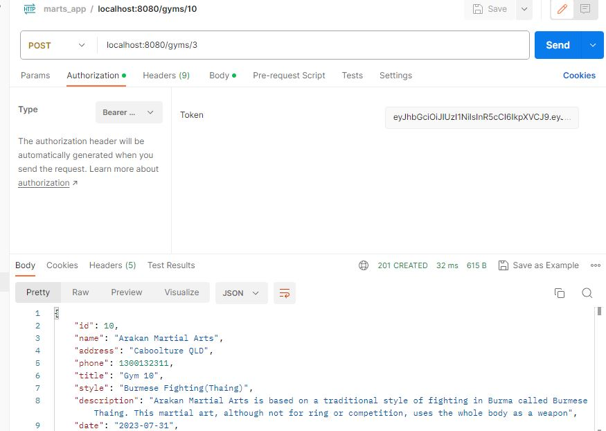


## Route: "/<int:id>"

- Method: GET
- @gyms_bp.route('/<int:id>', methods=["GET"])
- Functionality: Gets a gym by specified id.
- Local Host URL: localhost:8080/gyms/<int:id>
- JSON Body & example: 

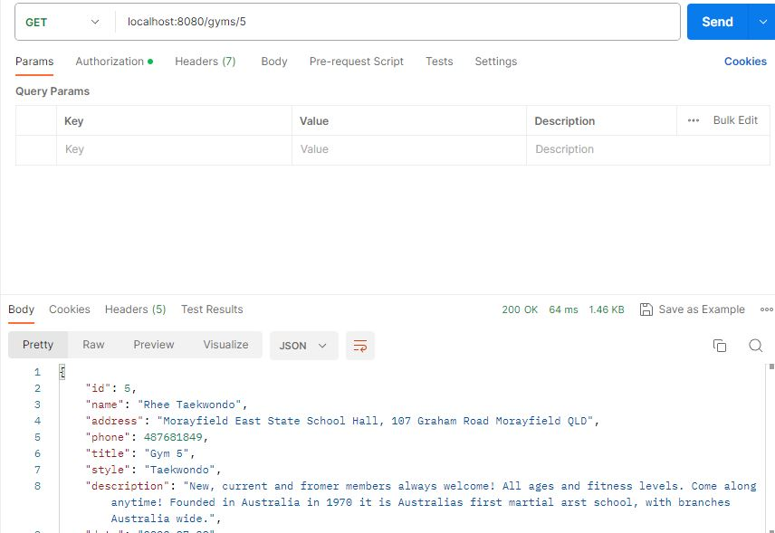
- Get one gym by ID 


## Route: "/<int:id>"

- Method: PUT, PATCH
- @gyms_bp.route('/<int:id>', methods=['PUT', 'PATCH']) 
- Functionality: Update a gyms information.
- Local Host URL: localhost:8080/gyms/<int:id>
- JSON Body & example:

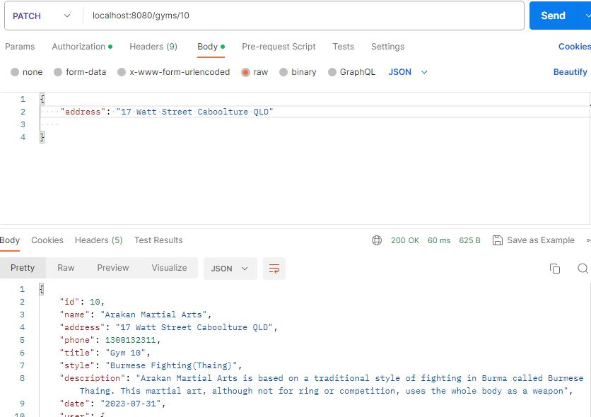
- I updated the address for the gym, you can see that it has changed the address. 


## Route: "/<int:id>"

- Method: DELETE
- @gyms_bp.route('/<int:id>', methods=['DELETE'])
- Functionality: Delete one gym by ID.
- Local Host URL: localhost:8080/gyms/<int:id>
- JSON Body & example:

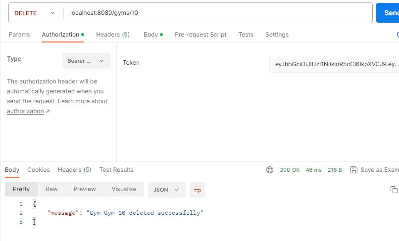
- In this example I successfully deleted gym 10


# Comments:

# URL prefix = "/gyms/<int:gym_id/comments"

## Route: "/"

- Method: POST
- @comments_bp.route('/', methods=['POST'])
- Functionality: Creates a new comment for a gym.
- Local Host URL: localhost:8080/gyms/gym_id/comments
- JSON Body & example:

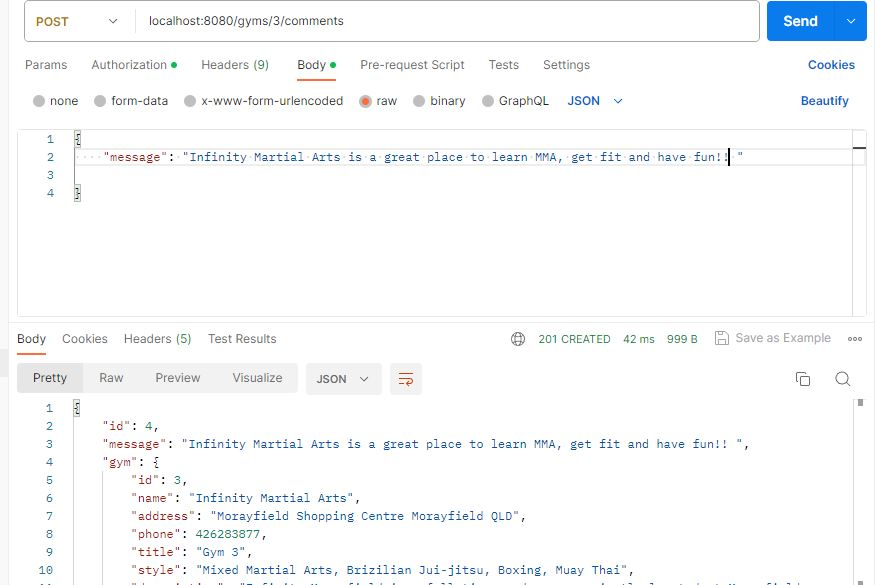
- You can see comment was created and added to gym 3 which is Infinity Martial Arts. (Please ignore my comment_id says '4', but I used it for testing earlier).


## Route: "/<int:comment_id>"

- Method: DELETE
- @comments_bp.route('/<int:comment_id>', methods=['DELETE'])
- Functionality: Deletes a comment from a gym.
- Local Host URL: localhost:8080/gyms/gym_id/comments/comment_id
- JSON Body & example:

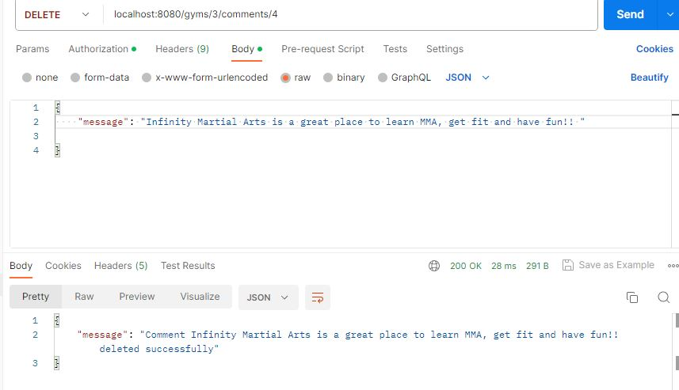
- Shows that I deleted comment_id (4) successfully.


### RESOURCES:

https://github.com/JRBoland/JamesBoland_T2A2#req4 (I liked the way this person set out there endpoints)


# R6:	An ERD for your app

For further details on this ERD, please see R9.

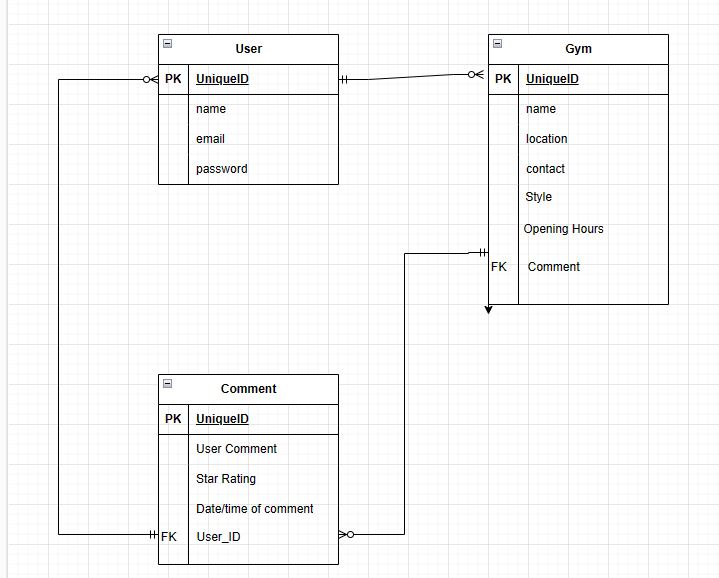


# R7:	Detail any third party services that your app will use

The Martial Arts API uses several third party services. These are a list of the ones I used, in alphabetical order:

Bcrypt: 

Bcrypt is a password-hashing function that is commonly used to store passwords securely in databases. Bcrypt uses what is called a salted hash function that basically generates a hashed version of the password that is difficult to reverse-engineer. The 'salt' is a random value that is generated for each password, which helps prevent attackers from using precomputed hashes to crack passwords. Bcrypt is considered one of the most secure hashing functions available, and it is used by many web applications and frameworks, including Flask, which we also used in this app. Libraries such as Flask-Bcrypt provide easy-to-use interfaces for hashing and verifying passwords using Bcrypt.

Flask:

This API application was developed using Flask, which is a popular Python web framework that helps simplify web applications and RESTful web service development. Flask is built on top of the Werkzeug WSGI toolkit, which handles web server requests and responses, and it also uses Jinja2 template engine for rendering HTML templates. Flask provides a wide range of extensions that allow developers to quickly build scalable applications without needing to worry too much about low-level details. It is a micro-framework that provides a lightweight and flexible way to build web applications. Flask is also easy to set up and is a good recommendation for small to medium-sized web applications. The Flask framework is highly extensible, with many libraries available to integrate and expand its functionality. Flask also has a large community of users and contributers who help provide documentation, tutorials and support to help developers to get started with the framework.

JSON Web Token (JWT):

JSON Web Token (JWT) is an open standard for securely transmitting information between parties as a JSON object through the use of digital signature. JWT is commonly used for authentication and authorisation purposes in web applications. A JWT consists of three parts: a header, a payload and a signature. The header contains information about the algorithm used to sign the token, while the payload contains information about the user and other data. The signature is verify the authenticity of the token. JWT is supported by many programming languages and frameworks, including Python and Flask. Libraries such as PyJWT provide easy-to-use interfaces for generating and verifying JWTs.

So in regards to my API, I also used JWT-Flask-Extend, which is a Flask extension and provides a link between Flask and JWT, which helps simplify the process of using JWT for authentication and authorisation purposes. You may notice that there are special admin privileges in my API, namely in deleting a gym, I though it necessary that either admin or the owner of the gym should be the ones to delete a specific gym by ID. The use of JWT in this application protects certain admin routes, in this case namely deleting a gym, ensures that only a verified user with admin priviledges can delete a gym.

Marshmallow:

Marshmallow is an Object Relational Mapping (ORM) library that simplifies the process of serialising and deserialising Python objects. It is used to convert objects (in case of this API, JSON strings) to and from Python data types. Marshmallow uses what is called a 'schema' or 'blueprint' to define and validate input data, as well as to convert the input data to a JSON string for use within an API. The JSON string can be serialised back to Python types, as it is defined by the schema. Marshmallow is commonly used in conjunction with Flask-Marshmallow, which is a Flask extension that simplifies the use of Marshmallow within the Flask environment. Marshmallow is also an open source library that is actively maintained and also has extensive documentation, tutorials and heaps of community support. 

PostgreSQL:

I used PostgreSQL as the database for this API project. ProgreSQL is a powerful, open source object-relational database system that uses and extends the SQL(Structured Query Language) language. It is widely used and has a large community of users and contributers. PostgreSQL provides many advanced features such as transactions and support for JSON and other data types. It is known for its reliability, data integrity and the ability to handle complex queries and large datasets. PostgreSQL is available on many platforms, including Windows, macOS and Linux.

Postman:

Postman is a popular collaboration platform for API development that simplifies the process of designing, testing, documenting and sharing APIs. It provides an intuitive interface for creating requests, organising them into collections and sharing them with team members or clients. Postman supports many HTTP methods such as GET, POST, PUT, PATCH and DELETE plus many more. It also provides features such as atomatic URL encoding, response validation (such as what was required for this app) and scripting using JavaScript. Postman is available as a desktop application for Windows, Linux and macOS users (with some handling issues) or web application.


Psycopg2:

Psycopg2 is a PostgreSQL database adapter for the Python programming language. It allows Python programs to interact with PostgreSQL databases using Python code. Psycopg2 provides a simple and efficient API for performing database operations such as covering CRUD (Create, Read, Update, Delete) functionality. Psycopg2 is widely used in production environments and has been tested with many versions of PostgreSQL. It is compatible with both Python 2 and Python 3 versions and is also available on multiple platforms, including macOS, Linux and Windows. 

### RESOURCES:

https://www.postgresql.org/about/

https://www.tecmint.com/what-is-postgresql-how-does-postgresql-work/

https://auth0.com/blog/hashing-in-action-understanding-bcrypt/

https://en.wikipedia.org/wiki/Bcrypt

https://pythonbasics.org/what-is-flask-python/#:~:text=Flask%20is%20a,web%20app%20framework.

https://careerfoundry.com/en/blog/web-development/what-is-flask/

https://auth0.com/learn/json-web-tokens#!#

https://www.howtogeek.com/devops/what-are-json-web-tokens-jwts-why-do-apis-use-them/

https://www.sweetandsara.com/flask-marshmallow-serialize-and-deserialize-python-objects/

https://www.golinuxcloud.com/python-marshmallow/#:~:text=Python%20marshmallow%20is,and%20vice%20versa.

https://www.postman.com/product/what-is-postman/

https://www.guru99.com/postman-tutorial.html#:~:text=Postman%20is%20a,What%20is%20Postman%3F

https://www.psycopg.org/docs/


# R8:	Describe your projects models in terms of the relationships they have with each other

The models used in my Martial Arts API are User, Gym and Comment. These can be found in their respective files within the /src/models/ folder. 

User Model:

user.py

Once a new user is created with an email and password registered to the user, they can get a list of gyms, post a comment if they have been to the gym, delete the comment and they can delete the user if they no longer want to use the API.


```
# Define a User Model
class User(db.Model):
    __tablename__ = 'users'

    # Define the columns of the table
    id = db.Column(db.Integer, primary_key=True)
    name = db.Column(db.String)
    email = db.Column(db.String, nullable=False, unique=True)
    password = db.Column(db.String, nullable=False)
    is_admin = db.Column(db.Boolean, default=False)

    # Define relationships with other models
    gyms = db.relationship('Gym', back_populates='user', cascade='all, delete')
    comments = db.relationship('Comment', back_populates='user', cascade='all, delete')
```

- __tablename__ defines the table name to be mapped to the model.

- id = db.Column(db.Integer, primary_key=True) Defines a column called 'id', which as shown here, is of the integer type. Notice it is also set up as the primary key.

- All of the remaining fields (name, email, password, is_admin) are created with their data types and character limits either Boolean or String or (). I made the email unique so no duplicate emails could be used, for extra security.

- The is_admin will revert to false if not included when user was created. Is_admin is use to determine if a user is authorised for certain actions within the API (such as deleting gyms).

- Relationships:
    - User has:
        - One to many relationship with gyms,
        - One to many relationship with comments.


Gym Model:

gym.py

```

# Define a Gym Model
class Gym(db.Model):
    __tablename__= "gyms"

    # Define the columns of the table
    id = db.Column(db.Integer, primary_key=True)
    name = db.Column(db.String(100))
    address = db.Column(db.String(100))
    phone = db.Column(db.Integer)
    style = db.Column(db.String(100))
    description = db.Column(db.Text)
    date = db.Column(db.Date)
    title = db.Column(db.String(100))

    # Define a relationship with the User Model
    user_id = db.Column(db.Integer, db.ForeignKey('users.id'), nullable=False)
    user = db.relationship('User', back_populates='gyms')

    # Define a relationship with the Comment Model
    comments = db.relationship('Comment', back_populates='gym', cascade='all, delete')

```

- __tablename__ defines the table name to be mapped to the model

- id = db.Column(db.Integer, primary_key=True). This creates a column with with the title 'id' which is of integer data type. you will notice that this is also a primary key.

- The remaining fields (name, address, phone, style, description, date, title) are created with their data type and character limits (string(100)), text, date and integer.

- Relationships:
    - Gyms have:
        - One to many relationship with comments (One gym would have many comments)
        - One to many relationship with user (a user can make many comments)


Comment Model:

comment.py

```
# Define a Comment Model
class Comment(db.Model):
    __tablename__ = 'comments'

    # Define columns for table
    id = db.Column(db.Integer, primary_key=True)
    message = db.Column(db.Text)


    # Define relationship with other models
    user_id = db.Column(db.Integer, db.ForeignKey('users.id'), nullable=False)
    gym_id = db.Column(db.Integer, db.ForeignKey('gyms.id'), nullable=False)

    user = db.relationship('User', back_populates='comments')
    gym = db.relationship('Gym', back_populates='comments')

```

- __tablename__ defines the table name to be mapped to the model

- id = db.Column(db.Integer, primary_key=True). This creates a column with the title 'id' which is an integer data type. You may notice that this is also a primary key.

- The last remaining field (message) has a text data type.

- Notice the relationship between the other models? They are listed as foreign keys.

- Relationships:
    - Comment has:
        - One to many relationship with user (one user can leave many comments)
        - One to many relationship with Gym (one gym will have many comments).

Oh, and here is a photo of those pesky tables I kept mentioning about:

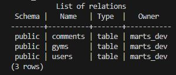


### RESOURCES:

https://github.com/JRBoland/JamesBoland_T2A2#req4 (again, I liked the way this person set out their response)


# R9:	Discuss the database relations to be implemented in your application

Please see R6 for my Entity Relational Diagram (ERD) as it is a visual representation of the relations that were used as part of the planning process for building this application.

- USER relationships:
    - The user table has a user_id which will be the primary key.

    - The user table has a one-to-many relationship with gym table. This is shown by the  single lined connector attached to the user table, and the multi-lined connector attached to the gym table.

    - The user table also shares a one-to-many relationship with comment table. This is shown by the single lined connector attached to the Foreign Key (FK) user_id in comment table, and the multi-lined connector to user table.


- GYM relationships:
    - The gym table has a gym_id which will be the primary key.

    - The gym table has a one to many relationship with comment table. This is depicted by the single lined connector attached to FK comment in gym table, and the multi-lined connector attached to comment table.

    - The gym table also shares a one-to-many relationship with user. This is shown by the single lined connector attached to the user table, and the multi-lined connector attached to the gym table.


- COMMENT relationships:
    - The comment table has a comment_id which will be the primary key.

    - The comment table has a one-to-many relationship with user. This is shown by the single lined connector attached to the FK user_id in comment table, and the multi-lined connector attached to the user table.

    - The comment table also has a one-to many relationship with gym table. This is depicted by the single lined connector attached to FK comment in gym table, and the multi-lined connector attached to the comment table.


# R10:	Describe the way tasks are allocated and tracked in your project 

The first thing was to come up with an idea for the application and present this to an educator for approval prior to starting the build. Here is the approval for my idea:

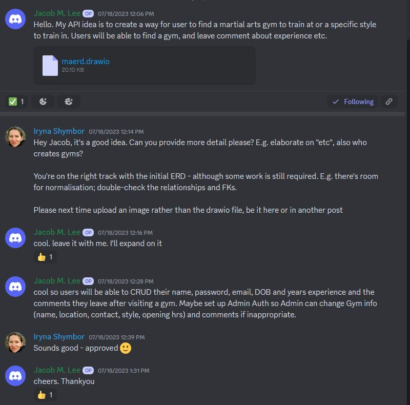

As you can clearly see, it was a very rough proposal for the app idea. However this initial idea remained as the structure of how the project should be built, with very little changes made.

For the task management side of things, I would of used Trello to track and manage tasks accordingly through the task management site. However since there was no supervisors checking or reviewing tasks and it was just me left to move cards around (and I ran out of time), so I skipped this part. However I will show how I would have set tasks based on the order of how I created this application.

The list of tasks that I followed include:

- Finalise ERD and get approval (check)

- Initial setup
    - create virtual environment for API project (venv)
    - download all third party apps required for the build (requirements.txt)
    - create init.py
    - create main.py

- Database Commands
    - Flask db create
    - Flask db drop
    - Flask db seed

- Controllers
    - Auth_controller (user)
        - /auth/login
        - /auth/register
        - create user
        - delete user

    - Gym controller
        - get all gyms
        - get one gym by ID
        - post one gym
        - delete one gym by ID
        - Patch one gym by ID

    - Comment Controller
        - post a comment on a gym by ID
        - delete a comment from a gym by ID

    - Auth permissions
        - Default admin is false
        - admin is true for gym deletion. I made admin create the gyms for my app, so they would not be deleted by anyone. 

        - error handling

And finally...Make sure it all works!!

### RESOURCES:

https://github.com/JRBoland/JamesBoland_T2A2#req4 (again, I like the layout for their response)
